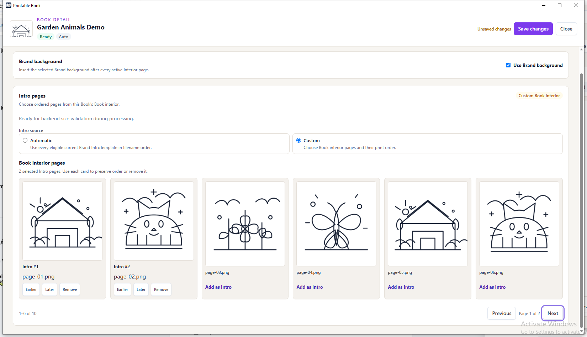
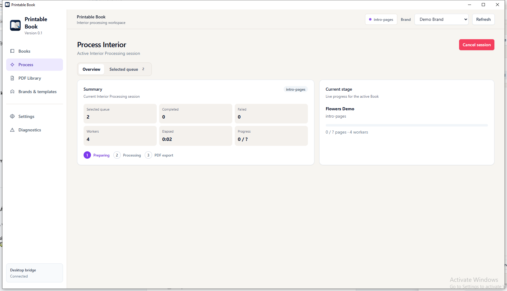
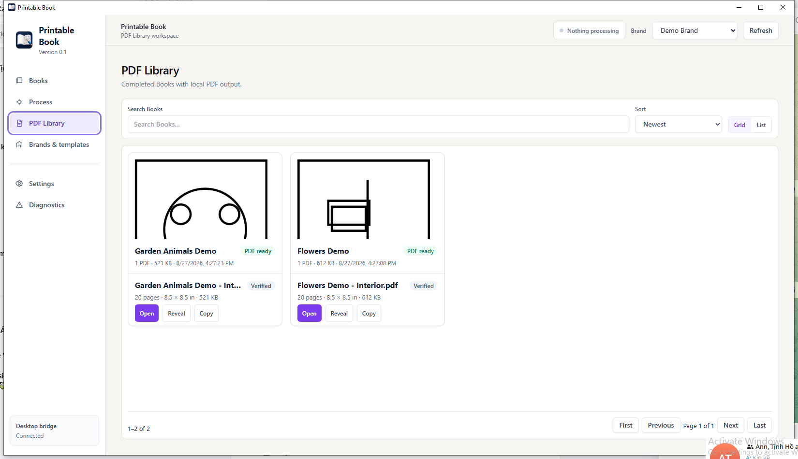
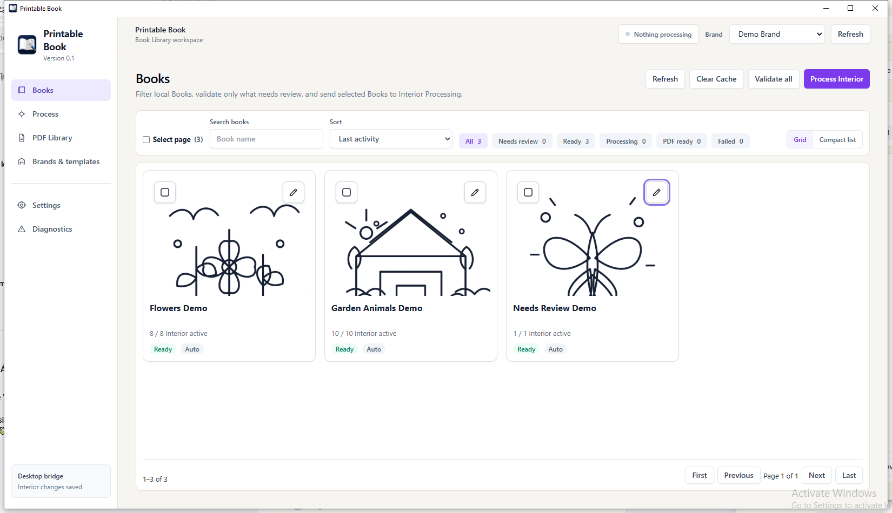

# Printable Book

## Printable Book dùng để làm gì?

Printable Book là phần mềm Windows chạy local để tổ chức Book Coloring, kiểm tra dữ liệu đầu vào, chuẩn bị Interior artwork và xuất PDF cho workflow KDP. Ứng dụng dùng ảnh và thư mục ngay trên máy của bạn; không cần upload Book lên dịch vụ bên ngoài.

## Yêu cầu hệ thống

- Windows x64.
- Bản portable v0.1: giải nén vào thư mục có quyền ghi, ví dụ `C:\PrintableBook\`.
- Không đặt bản chạy chính trong `Program Files`: `brands/`, `sources/`, `settings.json` và `.workspace/` được quản lý cạnh executable.
- Để build source: .NET 10 SDK, Node.js 24 và Windows (WPF/WebView2 host).

## Cấu trúc thư mục

```text
PrintableBook/
├─ PrintableBook.exe
├─ Frontend/
├─ Assets/
├─ brands/
├─ sources/
└─ settings.json
```

Mỗi Book nằm trong `sources/`. Khi xử lý, Book có `.workspace/` riêng cho state/cache và `Output/` cho PDF đã publish.

## Bắt đầu nhanh

1. Download ZIP release, giải nén vào thư mục writable.
2. Chạy `PrintableBook.exe`.
3. Thêm Brand vào `brands/` và Book vào `sources/`.
4. Trong **Books**, nhấn **Refresh** và chọn Brand.
5. Mở Book detail để kiểm tra Interior, Intro, Active và Frame mode.
6. Chọn Book, nhấn **Process Interior**, sau đó xem PDF trong **PDF Library**.

## Workflow

```text
Brand + Book folders
→ Refresh
→ kiểm tra/chọn Interior
→ Process Interior
→ PDF Library
```

Mỗi trang Interior được chuẩn hoá thành `normalized-source.png`, sau đó classification dùng BorderLine V3 và BorderPixel V1 fallback, preparation, frame (nếu có), assembly và export PDF. Chi tiết kỹ thuật nằm trong [architecture](docs/architecture.md).

## Intro AUTO và CUSTOM

- **AUTO** (`HasIntro=false`): dùng toàn bộ ảnh hợp lệ trong `Brand/IntroTemplate/`, theo tên file tăng dần.
- **CUSTOM** (`HasIntro=true`): dùng danh sách Book Interior do bạn chọn và giữ đúng thứ tự đó. Những trang đã chọn không lặp lại trong Interior normal hoặc shuffle.

Intro luôn được xử lý theo CropArt, không chạy detector và không dùng frame. Nếu bật Brand Background, background được chèn sau từng trang Intro và Interior.



## Process Interior

**Process** hiển thị queue, current stage, số worker và tiến độ. Mỗi session chỉ xử lý một Book tại một thời điểm; concurrency chỉ áp dụng các trang trong Book hiện tại, từ 1 đến 12 worker. Bạn có thể request **Cancel session**; cancellation là cooperative nên trạng thái sẽ chuyển terminal khi worker đã dừng an toàn.



## PDF Library

**PDF Library** hiển thị PDF Interior đã hoàn thành. Từ card bạn có thể **Open**, **Reveal** trong Explorer hoặc **Copy** path. Clear Cache chỉ xoá raster trung gian của Book đã hoàn thành, không xoá PDF đã publish.



## Screenshots



Hướng dẫn thao tác đầy đủ bằng tiếng Việt: [User Guide](docs/user-guide.md).

## Build & Test

```powershell
dotnet restore PrintableBook.sln
dotnet build PrintableBook.sln --configuration Release --no-restore
dotnet test tests/PrintableBook.Core.Tests/PrintableBook.Core.Tests.csproj --configuration Release --no-build
dotnet test tests/PrintableBook.Infrastructure.Tests/PrintableBook.Infrastructure.Tests.csproj --configuration Release --no-build --filter "TestScope!=LocalCorpus"
dotnet test tests/PrintableBook.Desktop.Tests/PrintableBook.Desktop.Tests.csproj --configuration Release --no-build
node --test tests/PrintableBook.Desktop.Bridge.Tests/app-bridge.test.mjs
node src/PrintableBook.Desktop/Frontend/test-production-ui.mjs
```

Corpus ảnh do user cung cấp ở `TestResults/` thuộc `LocalCorpus`, chỉ chạy local opt-in và không phải dependency của CI. Xem [Testing policy](docs/architecture.md#kiểm-thử).

## Kiểm thử artifact với Book mẫu

`.booksample/` là dữ liệu local bị Git ignore, chỉ dùng để smoke test **artifact đã publish hoặc giải nén**; không được copy vào Debug output hay đóng gói mặc định trong bản phát hành. Sau khi publish hoặc giải nén artifact vào một thư mục riêng, cài Brand và Book mẫu bằng:

```powershell
pwsh ./scripts/install-artifact-samples.ps1 -ArtifactRoot "C:\PrintableBook-test"
```

Script mặc định không ghi đè Brand hoặc Book mẫu cùng tên đã có. Với một artifact test sạch nhưng cần cập nhật lại sample cùng tên, dùng `-Force`. Sau đó chạy `PrintableBook.exe` từ artifact root, nhấn **Refresh**, validate Brand `demo`, rồi kiểm tra Book `book-sample` trong Books và Process Interior.

## Tài liệu kỹ thuật

- [Kiến trúc v0.1](docs/architecture.md)
- [Background process session](docs/background-process-session.md)
- [BorderLine V3](docs/borderline-detector-v3.md)
- [BorderPixel V1](docs/borderpixel-detector-spec.md)
- [Interior pipeline](docs/interior-shared-pipeline-integration.md)
- [Intro processing](docs/intro-template-processing.md)

## Release

v0.1.0 là portable, unsigned Windows x64 ZIP. Release notes: [docs/release-0.1.md](docs/release-0.1.md). Hướng dẫn tạo artifact: `scripts/publish-release.ps1 -ExpectedVersion 0.1.0`.
