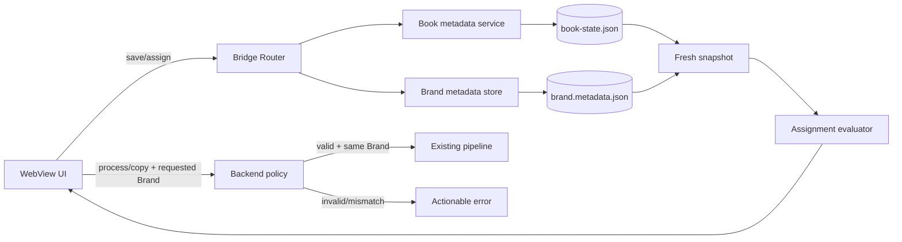

<!-- /autoplan restore point: C:\Users\admin\.gstack\projects\coloringbook\plan-book-brand-author-mvp-autoplan-restore-20260922-142850.md -->

# MVP Book Metadata, Brand Author và Brand Assignment

## 0. Trạng thái

- Phase: **implemented** trên branch `plan/book-brand-author-mvp`; đang chờ review/merge.
- Branch: `plan/book-brand-author-mvp`, tạo từ `main` tại `4041c006`.
- Chiến lược: additive, local-first, không refactor pipeline hiện tại.
- Verdict: **giữ scope MVP, nhưng assignment phải là guardrail thật cho Book đã assign**.
- Restore point trước `/autoplan`: `C:\Users\admin\.gstack\projects\coloringbook\plan-book-brand-author-mvp-autoplan-restore-20260922-142850.md`.
- Implementation commits: persistence `40a7196`, snapshot/service `b63696f`, workflow guards `978396f`, UI `85e1483`, regression hardening `d40a384`, docs `90bd8d3`, metadata repair `86715ed`.

## 1. Executive summary

MVP bổ sung metadata production cho Book, một Author cho mỗi Brand, explicit assignment từ Book sang Brand, và Brand filter trong Book Library. Dữ liệu cũ không cần migration và vẫn load/process như trước.

Điểm quan trọng nhất từ review: filter chỉ tổ chức danh sách, không phải hàng rào an toàn. Với **Book đã assign**, mọi thao tác tiêu thụ Brand phải kiểm tra ở backend rằng Brand đang dùng chính là Brand được assign và assignment còn `Valid`. Với **Book legacy chưa assign**, workflow cũ vẫn dùng Processing Brand toàn cục. Chỉ Book đã chủ động tham gia assignment contract mới nhận guardrail mới.

```text
Book mới/legacy → Metadata Unknown → phân tích bằng ChatGPT Web
→ điền và Save metadata → chọn Brand cùng Author → Assign
→ chọn Brand filter → chỉ thấy Book đã assign → tiếp tục production workflow
```

## 2. Problem, outcome và success criteria

### Problem

- Book hiện được nhận diện chủ yếu bằng tên folder, chưa có production metadata.
- Brand chưa có Author để tạo guardrail khi gán Book.
- Brand process là lựa chọn toàn cục; Book list không có scope theo assignment.
- Client filter đơn thuần không ngăn selection ẩn hoặc stale request chạy sai Brand.

### Outcome bắt buộc

- Metadata và assignment survive restart.
- Assign chỉ hợp lệ khi Authors match theo contract bên dưới.
- Brand filter chỉ dựa trên persisted assignment, không dựa trên Author similarity.
- Book đã assign không thể chạy Brand-consuming action bằng Brand khác/assignment invalid.
- Book chưa assign tiếp tục workflow cũ để bảo đảm backward compatibility.
- Không silent reassignment, migration hoặc direct ChatGPT integration.

### Success criteria

- Contract tests chứng minh mọi assigned Book từ chối effective Brand khác assignment.
- Metadata/Brand Author/assignment round-trip qua restart.
- Không regression Process Interior, Production Assets, Brand validation và cache cleanup.
- Metadata + assignment hoàn tất trong Book Detail, không cần sửa JSON.
- Đổi Brand filter không để lại hidden selection có thể process.

Không thêm telemetry trong MVP; đo bằng automated tests và manual acceptance.

## 3. Scope đã chốt

### Must-have

1. Book metadata: `Title`, `Subtitle`, `Subcover`, `Description`, `Author`.
2. Brand metadata: đúng một `Author`.
3. Explicit Book → Brand assignment, tối đa một Brand.
4. Derived assignment status và rescue flow khi invalid.
5. Filter: `All`, `Unassigned`, từng Brand.
6. Backend guard cho Brand-consuming actions của assigned Book.
7. Backward compatibility cho data cũ.
8. Tests cho normalization, persistence, snapshot, bridge và processing guard.

### Out of scope

- Nhiều Author, Author entity/key/profile/database/mapping table.
- Edition/ProductionJob abstraction; Brand UUID/manifest; rename migration.
- Auto-detect, direct ChatGPT integration, structured prompt import.
- Auto/bulk assignment, bulk metadata, prompt history, metadata versioning.
- Auto partition một batch thành nhiều Brand queue.
- Provenance/fingerprint cho PSD/output cũ; KDP export; tự điền PSD.
- Refactor `BookProcessingState`, pipeline hoặc global Brand selection.

### Product debt chấp nhận có chủ đích

- Brand identity tiếp tục là folder name. Rename/delete làm assignment invalid; không tự relink.
- Free-text Author là business guardrail, không phải security identity. Nhiều Brand cùng Author vẫn cần user chọn explicit.
- Metadata phase này phục vụ lưu/hiển thị/search/assignment, chưa đi vào PSD/output.
- Không chứng nhận provenance của template/output cũ sau reassignment; UI không được relabel output cũ như đã build bởi Brand mới.

## 4. Decision log

| Vấn đề | Quyết định | Lý do |
|---|---|---|
| Filter có đủ an toàn? | Không; thêm backend guard cho assigned Book. | Pipeline nhận một `BrandName`; client không phải authority. |
| Bắt legacy Book assign? | Chưa trong MVP. | Unassigned tạm thời giữ behavior cũ; phase sau sẽ khóa sau khi có kế hoạch chuyển đổi dữ liệu. |
| Bỏ global Brand và derive từ assignment? | Không. Assigned Book chỉ chạy khi hai giá trị trùng. | Giữ request/pipeline hiện tại. |
| Batch nhiều assigned Brand? | Reject; không partition. | Worker hiện hỗ trợ một Brand/session. |
| Lưu Brand UUID? | Không; lưu canonical folder name. | UUID/manifest là migration ngoài scope. |
| Brand rename/delete? | `MissingBrand`, explicit reassignment. | Không silent relink. |
| Thêm `Needs assignment` filter? | Không. Invalid ở `All` và Brand filter, có badge. | Hold scope. |
| Có Unassign? | Có, explicit secondary action. | Cần rescue path. |
| Auto-select/auto-switch? | Không. | Assignment và execution context đều explicit. |
| `Subcover` là gì? | Optional single-line text, dài đúng 4 hoặc 5 ký tự sau trim; không phải file/path. | Quyết định sản phẩm đã xác nhận. |
| Processing Brand khác assigned Brand? | Backend chặn action và trả lỗi rõ ràng; không auto-switch. | Assignment phải là safety boundary thật. |
| Reassign Brand A → B? | Hiện cảnh báo xác nhận; không xóa/copy lại template hoặc output. | Tránh silent side effect và làm rõ asset cũ vẫn còn. |
| Book persistence? | Nested metadata + assignment trong existing workspace state. | Atomic boundary hiện có, không migration. |
| Brand persistence? | File riêng `brand.metadata.json`. | Không trộn vào validation certificate/settings. |
| Đổi dữ liệu khi process? | Chặn mutation mới trong active session. | Tránh race snapshot/effective Brand. |

## 5. Domain contract

### 5.1 Book metadata

```text
BookProductionMetadata
- title: string?
- subtitle: string?
- subcover: string?
- description: string?
- author: string?
```

- Mọi field optional; partial Save hợp lệ.
- Empty/whitespace-only canonicalize thành `null`.
- `Unknown` chỉ là display/placeholder, không persist literal `"Unknown"`.
- Author là Primary Author duy nhất.
- Title/Subtitle/Author single-line.
- Subcover là optional single-line text. Sau outer trim, nếu có giá trị thì phải dài đúng **4 hoặc 5 ký tự**; không áp thêm regex, casing hoặc semantic rule trong MVP.
- Description là multiline free text; giữ line breaks và trim outer whitespace.
- Title có giá trị là display title; fallback tên folder. Folder name vẫn là secondary text/tooltip.
- Search match display title, folder name và Author; không rename source folder.

### 5.2 Brand Author

```text
BrandMetadata
- author: string?
```

- `1 Brand = 1 Author`; blank là chưa cấu hình.
- Giữ original text sau outer trim để hiển thị.
- Brand thiếu Author vẫn load/validate assets như cũ nhưng không là assignment candidate.
- Đổi/xóa Author không tự đổi Book; snapshot kế tiếp recompute status.

### 5.3 Author normalization

Một pure policy dùng ở mọi nơi:

```text
Nếu một bên null/blank → false
Trim leading/trailing whitespace
So sánh StringComparison.OrdinalIgnoreCase
```

Không collapse internal whitespace, bỏ dấu câu, transliterate hay fuzzy match.

| Book Author | Brand Author | Match |
|---|---|---|
| `Jane Doe` | ` jane doe ` | Yes |
| `Jane  Doe` | `Jane Doe` | No |
| `J. Doe` | `Jane Doe` | No |
| blank | blank | No |

### 5.4 Assignment status (derived, không persist)

Persist `assignedBrand` bằng canonical `DiscoveredBrand.Name`, không cho nhập tự do.

| Status | Điều kiện | Behavior |
|---|---|---|
| `Unassigned` | `assignedBrand` blank | Xuất hiện trong `Unassigned`. |
| `Valid` | Brand tồn tại và Authors match | Cho phép action nếu requested Brand trùng. |
| `BookAuthorMissing` | Assigned nhưng Book Author blank | Invalid. |
| `BrandAuthorMissing` | Assigned nhưng Brand Author blank | Invalid. |
| `AuthorMismatch` | Cả hai có Author nhưng không match | Invalid. |
| `MissingBrand` | Folder Brand không còn discover | Invalid; giữ tên cũ để hiển thị. |
| `BrandMetadataUnavailable` | Brand metadata lỗi đọc/parse | Invalid/fail closed; app vẫn load. |

Không ghi state chỉ vì derived status đổi.

### 5.5 Assign/reassign/unassign

- Selector chỉ liệt kê discovered Brands match **Book Author đã Save**.
- Brand không cần `Validated` để assign; validation asset là precondition process riêng.
- Backend reload Book state/Brand metadata, compare lại, rồi atomic-save canonical name.
- Stale UI hoặc crafted payload không bypass rule.
- Author draft chưa Save không authorize assignment.
- `Unassign` chỉ clear assignment; không xóa metadata/template/output/processing state.
- Không auto assign kể cả chỉ có một candidate.

### 5.6 Invalid assignment

- Book/Brand Author đổi không clear assignment.
- UI giữ Brand cũ, badge `Invalid`, reason cụ thể và yêu cầu reassign/unassign.
- Không candidate: hướng dẫn Save Book Author hoặc cập nhật Brand Author.
- Invalid vẫn ở `All` và filter Brand đã persist; không ở `Unassigned`.
- Brand-consuming actions bị disable ở UI và reject ở backend.

### 5.7 Brand filter

```text
All
Unassigned
<mọi discovered Brand, sort theo name>
```

- `All`: mọi Book.
- `Unassigned`: chỉ assignment null/blank.
- Brand: exact persisted assignment; Author match không tham gia filter.
- Assignment tới Brand đã xóa chỉ ở `All`, badge `MissingBrand`.
- Filter kết hợp Search/Status; paginate sau tất cả filter.
- Đổi filter reset page 1 và **clear toàn bộ Book selection** để không process hidden Book.
- `Select page` chỉ chọn visible items; status counters tính trong Brand scope trước Status chip.
- Filter không đổi Processing Brand, assignment hay persisted state.

## 6. Compatibility và processing safety

### 6.1 Hai khái niệm Brand

- `assignedBrand`: ownership/scope persist trên Book.
- `Processing Brand`: selector toàn cục hiện có, là Brand request pipeline dùng.

Đổi label toàn cục thành `Processing Brand`; filter riêng có label `Book Brand`. Không đổi behavior.

### 6.2 Compatibility matrix

| Book state | Requested Brand | Kết quả |
|---|---|---|
| Legacy/unassigned | Hợp rule cũ | Tạm thời allow trong MVP; phase sau sẽ chuyển sang bắt buộc assignment. |
| Assigned + `Valid` | Trùng assignment | Allow; pipeline cũ. |
| Assigned + `Valid` | Khác assignment | Reject rõ ràng. |
| Assigned + invalid | Bất kỳ | Reject; reassign/unassign. |
| Batch assigned nhiều Brand | Một Brand chung | Reject; không partition. |
| Assigned đúng Brand + legacy unassigned | Brand chung hợp lệ | Allow để giữ compatibility. |

### 6.3 Actions phải guard

- `process.start` / `interior-only` (Process Interior).
- `process.start` / `production-interior` (Build Final Interior).
- `book.brand.templates.copy` (Copy Brand Templates).
- Command tương lai nhận `brandName` và đọc Brand frame/background/Intro/templates dùng cùng policy.

Không guard edit metadata, Book preflight, upload Production Assets, open/reveal/copy path.

Hai lớp kiểm tra:

1. UI readiness disable sớm với actionable reason.
2. Backend dùng fresh snapshot; worker check lại trước khi đọc Brand assets.

Error codes dự kiến:

```text
book_brand_assignment_invalid
book_brand_mismatch
book_author_required
brand_author_required
assigned_brand_not_found
brand_metadata_invalid
mixed_assigned_brands_not_supported
```

## 7. Persistence

### 7.1 Book

Tái sử dụng `.workspace/state/book-state.json` và `IBookWorkspaceStateStore`:

```json
{
  "metadata": {
    "title": "...",
    "subtitle": "...",
    "subcover": "...",
    "description": "...",
    "author": "Jane Doe"
  },
  "assignedBrand": "Demo Brand"
}
```

Append optional `BookProductionMetadata? Metadata` và `string? AssignedBrand` vào `BookProcessingState`. Missing fields deserialize null; existing immutable `with` transitions giữ data mới. Một mutation service riêng thực hiện read-modify-write qua cùng gate để tránh lost update với Interior settings.

Không tạo Book file/store mới vì workspace state đã là atomic persistence boundary và cách này không cần reconciliation/migration.

### 7.2 Brand

```text
brands/<BrandName>/brand.metadata.json
```

```json
{ "author": "Jane Doe" }
```

- Missing file = Author chưa cấu hình.
- Atomic write qua `IFileSystem.WriteTextAtomicallyAsync`.
- Không dùng `settings.json`, `brand.validation.json` hoặc legacy `brand.json`.
- Không tham gia Brand fingerprint/validation certificate.
- Invalid JSON không crash app: snapshot đánh dấu unavailable, assignment fail closed; Save có thể repair.
- Không thêm `schemaVersion` vì versioning out of scope.

### 7.3 Identity

- Persist exact canonical folder name từ discovery; identity compare như processing hiện tại (`Ordinal`).
- Rename/delete → `MissingBrand`, explicit reassignment.
- Không fuzzy-relink theo Author.

## 8. Architecture và data flow

### 8.1 Existing code leverage

| Concern | Reuse | Thay đổi additive |
|---|---|---|
| Book persistence | `BookProcessingState`, workspace state store | Optional metadata/assignment + service. |
| Brand discovery | `IApplicationRootDiscovery` | Load metadata theo directory, giữ identity. |
| Atomic JSON | `IFileSystem` | `IBrandMetadataStore`/JSON adapter. |
| Snapshot | `IApplicationSnapshotService` | Project metadata + derived status. |
| Bridge | `WebViewBridgeRouter` | Bốn mutation commands + stable errors. |
| Process | `ProcessingSessionWorker.Validate` | Shared policy trước Brand assets. |
| Template copy | Existing bridge route | Shared policy trước copy. |
| UI | `app.js`, `book-workspace.css` | Overview forms, Brand card, filter/badges. |
| Concurrency | `ProcessingMutationGate` | Serialize/reject new mutations. |

### 8.2 New small contracts

- `BookProductionMetadata`, `BrandMetadata`, `BookBrandAssignmentStatus`.
- `AuthorMatchPolicy`, `BookBrandAssignmentEvaluator` (pure).
- `IBrandMetadataStore` + `JsonBrandMetadataStore`.
- `IBookCatalogMetadataService` cho Save/Assign/Unassign.
- `IBookBrandExecutionPolicy` dùng chung bởi snapshot/template/worker.

Không tạo generic repository, mapping table, event bus hoặc metadata framework.

### 8.3 Snapshot

```text
BookDesktopSummary: metadata, assignedBrand, assignmentStatus, assignmentReason
BrandDesktopSummary: author, metadataStatus, metadataError
```

Fields mới optional. Snapshot load Brand metadata một lần mỗi refresh, index theo name, rồi evaluate Books; không N×Books file reads.

### 8.4 Bridge commands

```text
book.metadata.save   { bookId, title, subtitle, subcover, description, author }
book.brand.assign    { bookId, brandName }
book.brand.unassign  { bookId }
brand.author.save    { brandName, author }
```

Success trigger fresh snapshot. Không gộp metadata Save với header `Save changes` dành cho Interior draft.

### 8.5 Data flow



## 9. UX/UI contract

### 9.1 Book Detail — Overview

Giữ drawer/tabs. Sau summary cards thêm:

1. `Book Information`: Title, Subtitle, Author và Subcover là single-line inputs; Subcover có hint `4–5 characters` và inline validation; Description là textarea; independent dirty/status; nút `Save Book Information`.
2. `Brand Assignment`: assigned Brand + status/reason; native select chỉ có matching Brands; explicit `Assign/Reassign Brand`; secondary `Unassign`; empty-state guidance. Reassign từ Brand A sang Brand B phải mở cảnh báo xác nhận rằng template/output cũ không tự bị xóa hoặc thay thế.

Không reuse header `Save changes` vì nút đó quản lý Interior draft. Metadata và Interior có dirty state độc lập. Đóng drawer khi metadata dirty phải cảnh báo/giữ nhất quán với unsaved changes, không silently discard.

### 9.2 Brands & templates

Thêm card `Brand Information` phía trên asset inventory: Author input, own Save/status. `Unknown` là placeholder. Nếu Author change dự kiến invalidate Books, hiển thị warning với count trước Save. Metadata error repair được bằng Save. Brand validation UI không đổi.

### 9.3 Book Library

- Select `Book Brand` cạnh Search/Sort, wrap khi width hẹp; options có counts.
- Book card/list row dùng Title fallback folder name; hiển thị folder secondary, Author, assignment badge.
- Invalid dùng text + danger treatment, không chỉ màu.
- Header global đổi label thành `Processing Brand`.

### 9.4 Feedback/accessibility/layout

- Đổi filter clear selected IDs; incompatible selection disable Process với reason.
- Brand mismatch copy: `Select Processing Brand “X” to continue.`; không auto-switch.
- Backend error giữ selection và focus actionable message.
- Visible labels, `aria-describedby`, `role=status/alert`, native select, focus restoration.
- Reuse tokens/badges; minimum control target 40px.
- Test 1280×720, 1600×900, Windows 200%; 2-column form collapse 1 column.

## 10. Failure modes

| Failure | Behavior | Recovery |
|---|---|---|
| Author blank | Không match/assign. | Save Author. |
| Case/outer-space khác | Match. | None. |
| Internal-space/punctuation khác | Mismatch. | Sửa text/chọn Brand khác. |
| Book/Brand Author đổi | Giữ assignment, invalid. | Reassign/Unassign. |
| Brand rename/delete | `MissingBrand`, không crash. | Reassign. |
| Malformed Brand metadata | Fail closed assignment, app vẫn load. | Save Author để repair. |
| Old Book JSON thiếu fields | Defaults null. | Không migration. |
| Stale UI request | Backend reload và reject. | Refresh/sửa metadata. |
| Process active | New mutations disabled/rejected. | Chờ hoàn tất. |
| Hidden selection | Filter change clear selection. | Chọn lại visible Books. |
| Multi-Brand batch | Reject, không partition. | Filter một Brand. |
| Atomic write fail | Old file giữ nguyên; báo lỗi. | Retry sau filesystem fix. |
| Reassign sau template cũ | Cảnh báo và yêu cầu xác nhận; không xóa file; chỉ future actions guard Brand mới. | User chủ động Copy Templates lại; provenance deferred. |

## 11. Test plan

### Domain/Core

- `AuthorMatchPolicyTests`: case/trim, blank, internal spaces, punctuation.
- Book metadata validation tests: Subcover blank/null hợp lệ; sau trim chỉ length 4 hoặc 5 hợp lệ; length khác bị reject với field error.
- `BookBrandAssignmentEvaluatorTests`: mọi status, missing Brand/metadata.
- `BookProcessingStateTests`: metadata/assignment survive start/complete/fail/settings; Unassign chỉ clear assignment.
- Metadata service tests: partial save, whitespace→null, assign/reassign/unassign, stale/mismatch reject.
- Execution policy tests: full compatibility matrix.

### Infrastructure/snapshot

- Old JSON backward compatibility; new round-trip; UTF-8/multiline.
- Brand store: missing/valid/blank/malformed/atomic overwrite.
- `brand.metadata.json` không đổi Brand validation fingerprint.
- Cache cleanup giữ metadata/assignment.
- Snapshot projects data, title fallback, recomputes status, isolates malformed Brand, loads each Brand once.

### Processing/bridge

- Worker: legacy pass; assigned same Brand pass; mismatch/invalid/mixed fail trước asset read; production mode same guard.
- Bốn bridge commands: valid/invalid payload, fresh Author recheck, canonical name, stable errors.
- Mutations blocked during processing.
- Template copy guard; unassigned legacy behavior unchanged.
- Success refreshes snapshot.

### UI/manual

- Unknown không persist literal; partial Save survives restart; Subcover chỉ nhận text dài 4–5 ký tự sau trim.
- Candidates exact match; unsaved Author không authorize.
- Invalid reason/rescue cho mọi state.
- Reassign A → B luôn yêu cầu confirmation và nêu rõ template/output cũ không tự đổi.
- Same-author unassigned Book không xuất hiện dưới Brand filter.
- Filter clears selection; grid/compact show title/author/badge.
- Keyboard/focus/error announcements.
- Smoke existing Process Interior, Final Interior, Production Assets, Copy Templates, Brand validation.

Verification gate khi implement:

```powershell
dotnet build PrintableBook.sln
dotnet test PrintableBook.sln --no-build
```

Manual fixture: hai Brand cùng Author, một Brand khác Author, legacy Book, valid Book và invalid Book.

## 12. Implementation sequence

Mỗi phase phải green trước phase tiếp theo.

1. ✅ **Contracts/persistence** — value records, normalization/evaluator tests, optional Book state, Brand store + DI.
2. ✅ **Services/snapshot** — mutation service, Brand metadata index, projected status, shared execution policy.
3. ✅ **Bridge** — bốn commands, payload validation, gate, refresh, contract tests.
4. ✅ **UI metadata/assignment** — independent draft, Book/Brand cards, rescue, title/search/badges.
5. ✅ **Filter/guard** — counts/pagination/selection reset; label clarity; template + worker guard; mixed-batch reject.
6. ✅ **Regression/docs** — full automated suite, corruption/race/compatibility contracts, user guide và known limitations. Bộ screenshot release hiện có không được thay bằng ảnh chưa qua packaged-app capture gate.

## 13. File impact map dự kiến

```text
src/PrintableBook.Core/
  Domain/Books/BookProductionMetadata.cs                          [new]
  Domain/Processing/BookProcessingState.cs                       [modify]
  Application/Brands/BrandMetadata.cs                            [new]
  Application/Brands/IBrandMetadataStore.cs                      [new]
  Application/Desktop/IBookCatalogMetadataService.cs             [new]
  Application/Desktop/IApplicationSnapshotService.cs             [modify]
  Application/BackgroundTasks/Workers/ProcessingSessionWorker.cs [modify]
  DependencyInjection/ServiceCollectionExtensions.cs             [modify]
src/PrintableBook.Infrastructure/
  BrandMetadata/JsonBrandMetadataStore.cs                        [new]
  DependencyInjection/ServiceCollectionExtensions.cs             [modify]
src/PrintableBook.Desktop/
  Bridge/WebViewBridgeRouter.cs                                  [modify]
  MainWindow.xaml.cs                                             [modify]
  Frontend/js/app.js                                             [modify]
  Frontend/css/book-workspace.css                                [modify]
tests/                                                           [new/modify]
docs/user-guide.md + screenshots                                 [after implementation]
```

## 14. Review conclusions

### Engineering

- PASS: optional fields + one Brand store fit local-first architecture.
- PASS: shared pure evaluator avoids duplicate normalization.
- PASS: worker/pipeline shape unchanged; only opted-in Book precondition.
- PASS: O(Brands + Books) snapshot and in-memory filter.
- WATCH: catalog data in `BookProcessingState`; accepted for MVP.
- WATCH: mutable folder name foreign key; mitigated by `MissingBrand`.
- WATCH: old template/output provenance not modeled; documented, not relabeled.
- Security/privacy: local-only; escape rendered metadata; bridge resolves discovered entities, never arbitrary paths.

### DX

- Commands follow `entity.scope.action`; stable code + actionable message.
- Snapshot additions optional; pure policies make tests fast.
- Add test builders/defaults to avoid constructor explosion.
- Không tạo generic repository/base store chỉ để giảm duplicate nhỏ.

### Outside-voice resolution

Independent review rejected draft vì assignment chưa được enforce. Kế hoạch nhận: backend enforcement, mixed-batch rejection, missing Brand/corrupt metadata states, rescue flow và Title downstream display/search.

Không nhận vào MVP vì trái scope: bắt legacy migration, bulk assignment, Edition/ProductionJob, Brand UUID, fuzzy Author identity, provenance framework. Đây là follow-up candidates, không phải unresolved decisions.

## 15. Final acceptance criteria

1. Data cũ load bình thường; regression suite pass.
2. Partial metadata Save; null hiển thị Unknown; Subcover optional nhưng nếu có phải là text dài đúng 4 hoặc 5 ký tự sau trim.
3. Brand Author độc lập Brand asset validation.
4. Assign chỉ khi saved Authors match trim + ordinal-ignore-case.
5. Author change giữ assignment và chuyển invalid.
6. Không auto assign; selector chỉ matching Brands.
7. Brand filter dùng persisted assignment, không Author equality.
8. Invalid Book vẫn tìm thấy với reason rõ.
9. Filter change clear hidden selection.
10. Assigned valid Book chỉ copy/process với assigned Brand; Brand mismatch bị backend chặn và trả lỗi actionable.
11. Invalid/missing Brand Book bị backend reject trước asset read.
12. Legacy unassigned Book tạm thời giữ workflow cũ trong MVP; việc bắt buộc assignment được hoãn sang phase sau.
13. Reassign Brand luôn có cảnh báo xác nhận; không tự xóa/copy lại template hoặc output cũ.
14. Không database, Author entity, direct ChatGPT, auto assignment hoặc pipeline refactor.

## 16. Follow-up candidates

- `Needs assignment` filter nếu volume invalid cao.
- Stable Brand ID nếu rename thường xuyên.
- Template/output Brand provenance và stale detection.
- Structured metadata paste/export nếu manual copy là bottleneck.
- Edition/ProductionJob nếu một source cần nhiều Brand outputs.
- Bulk assignment nếu legacy adoption chậm.
- Phase khóa processing đối với Book chưa assign, kèm migration/adoption plan cho Book legacy.

## 17. `/autoplan` report

| Review | Kết quả | Thay đổi chính |
|---|---|---|
| CEO/Product | HOLD SCOPE, harden safety | Enforcement, compatibility matrix, rescue, measurable acceptance. |
| Design | PASS WITH CHANGES | Overview forms, independent Save, clear hidden selection, accessible states. |
| Engineering | PASS WITH WATCH ITEMS | Fresh backend validation, atomic persistence, identity debt documented. |
| DX | PASS | Stable commands/errors, optional fields, pure policies, no over-abstraction. |
| Outside voice (Codex CLI) | Initial draft rejected | Nhận safety findings; từ chối scope expansions nêu trên. |

**Final verdict:** implementation hoàn tất trên branch hiện tại. Không còn quyết định sản phẩm/kiến trúc bắt buộc nào chưa chốt trong MVP.

## 18. Implementation verification

Ngày 2026-09-22:

```text
dotnet build PrintableBook.sln
→ succeeded, 0 warnings, 0 errors

dotnet test PrintableBook.sln --no-build
→ 938 passed, 5 skipped local-corpus tests, 0 failed
```

JavaScript frontend cũng pass `node --check`; `git diff --check` không phát hiện whitespace error. Năm test skip là các local corpus test đã có sẵn và cần dữ liệu ảnh ngoài repository, không thuộc feature này.
