# Hướng dẫn sử dụng Printable Book v0.1

## 1. Tổng quan

Printable Book làm việc hoàn toàn trên thư mục local: Brand trong `brands/`, Book trong `sources/` và output trong từng Book. Bắt đầu ở **Books**, sau đó thực hiện cấu hình trong Book detail và đưa Book vào Process queue.

## 2. Chuẩn bị Brand

Tạo một thư mục Brand dưới `brands/`. Brand có thể chứa `IntroTemplate/`, `frame.png`, `background.png`, `AppPlus/` và `brand.json`. `frame.png` phải tương thích artwork prepared; `background.png` phải đúng Final Page size khi bật Brand Background.

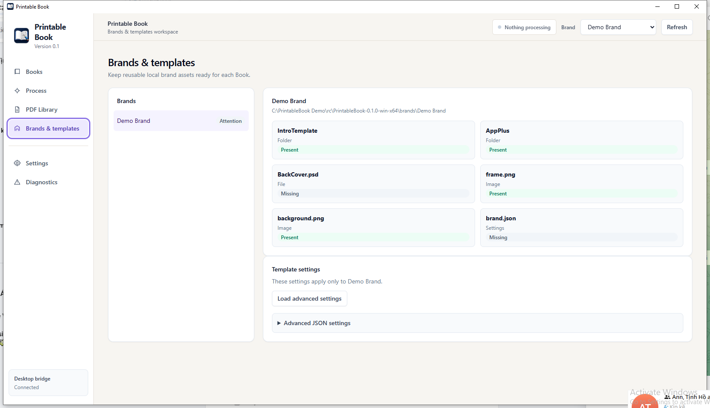

## 3. Chuẩn bị Book

Mỗi Book là một thư mục trực tiếp dưới `sources/`. Đặt ảnh cần xử lý vào `Book interior/`. Cover chưa phải điều kiện để chạy **Process Interior**; khi output full book được sử dụng sau này, Cover sẽ có luồng validation riêng.

## 4. Refresh Library

Trong **Books**, chọn Brand ở header rồi nhấn **Refresh**. Refresh quét local folders và dựng snapshot mới. Chỉ dữ liệu snapshot mới được dùng cho các mutation Book/Brand.

## 5. Book Overview

Card cho biết số trang Interior active, trạng thái và Frame summary. Nhấn icon edit để mở Book detail; checkbox/card dùng để queue Book vào **Process Interior**.

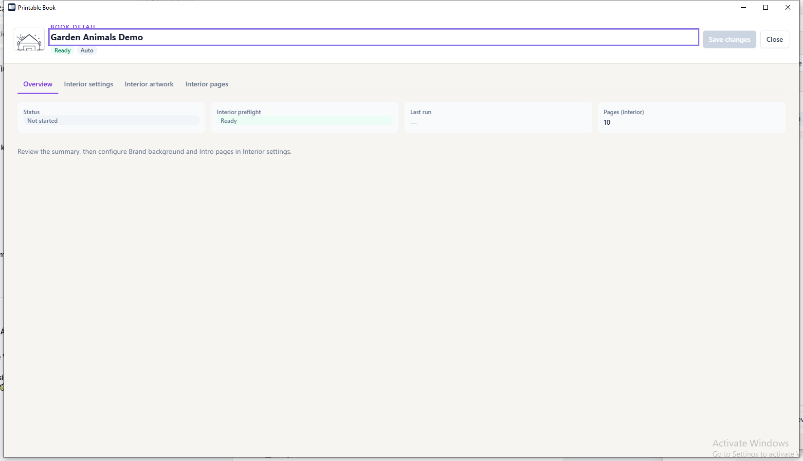

## 6. Interior settings

Tab **Interior settings** chứa cấu hình chung của Book. Nhấn **Save changes** sau khi chỉnh để lưu workspace state mà không phải xử lý ngay.

### 6.1 Brand Background

**Brand Background** bật/tắt việc chèn `background.png` sau mỗi Intro và mỗi Interior. File background phải có kích thước Final Page trong **Settings**.

### 6.2 Intro AUTO

Tắt **Custom Intro** để dùng AUTO: tất cả ảnh hợp lệ của Brand `IntroTemplate/` được dùng theo filename tăng dần.

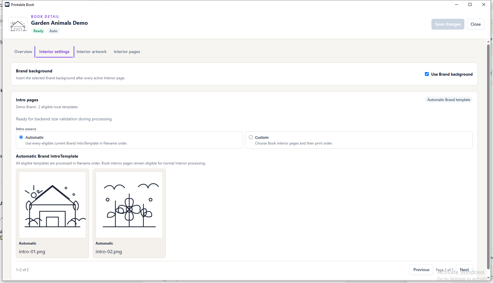

### 6.3 Intro CUSTOM

Bật **Custom Intro**, chọn ít nhất một ảnh Book Interior và điều chỉnh thứ tự. Các ảnh đã chọn được đánh dấu Intro và không xuất hiện lại trong Interior normal.

## 7. Interior artwork

Tab **Interior artwork** là nơi chọn nhanh các trang mà Book sẽ xử lý.

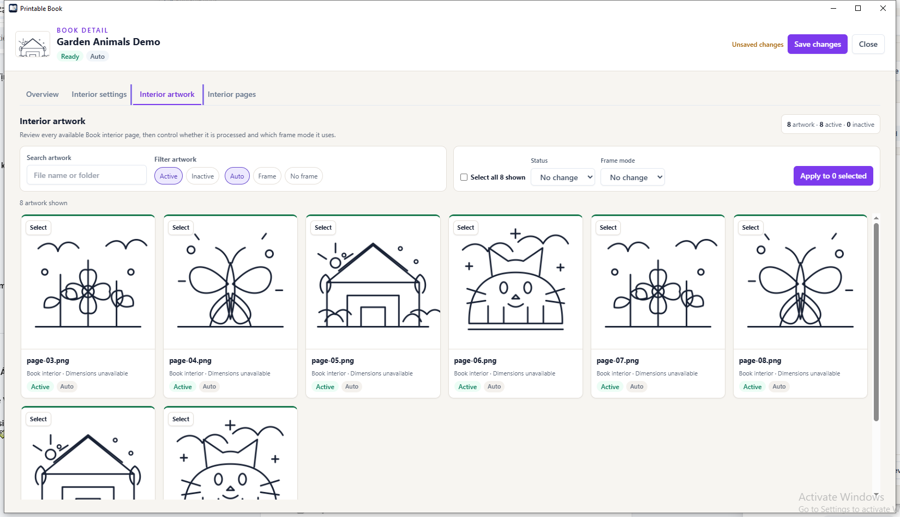

### 7.1 Active / Inactive

Trang **Active** được đưa vào normal Interior. Trang **Inactive** được giữ trong Book nhưng loại khỏi process/shuffle. Trang CUSTOM Intro không chịu Active filter trong khi đang được chọn Intro.

### 7.2 Frame Auto / Frame / No Frame

- **Auto**: dùng recommendation của classification.
- **Frame**: bắt buộc dùng frame tương thích của Brand.
- **No frame**: không dùng frame.

### 7.3 Bulk actions

Filter artwork, chọn card/ảnh hoặc **Select all shown**, chọn Status và Frame mode rồi nhấn **Apply**. Nhấn **Save changes** để ghi toàn bộ thay đổi.

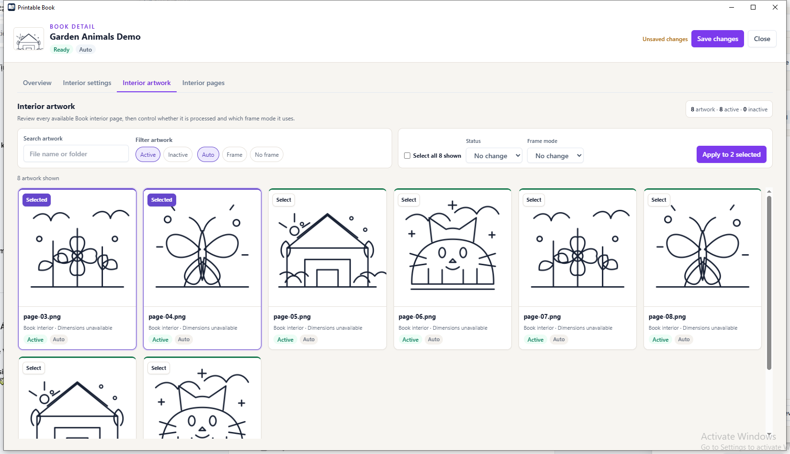

## 8. Interior pages preview

Sau một lần **Process Interior** hoàn thành, tab **Interior pages** là preview chỉ đọc của các page final đã publish. Nếu chưa process, tab hiển thị trạng thái không có page.

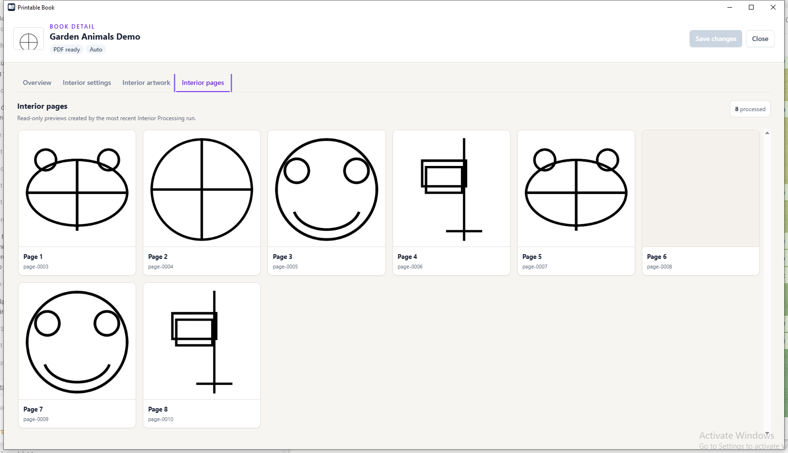

## 9. Chọn Books để Process

Trong **Books**, dùng checkbox ở card hoặc **Select page** cạnh Search để chọn hàng loạt. **Clear selection** bỏ toàn bộ lựa chọn. Nút **Process Interior** chỉ đưa Book đã chọn vào session mới.

## 10. Process queue

Tab **Selected queue** cho biết Book đang chờ. Có paging cho queue dài và có thể remove Book đã thêm nhầm trước khi start.

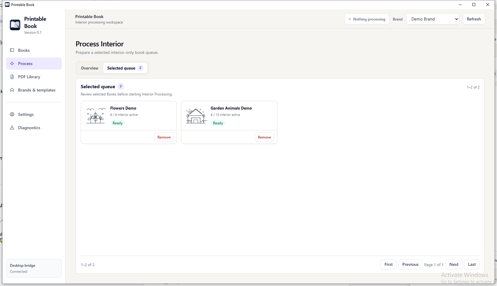

## 11. Theo dõi Processing

Tab **Overview** hiển thị current Book, current stage, worker count và page progress. Bạn có thể chuyển sang Books/PDF Library; session vẫn chạy nền. **Cancel session** gửi cancellation cooperative.

Khi terminal, Overview hiển thị summary Completed/Failed và queue snapshot cuối cùng.

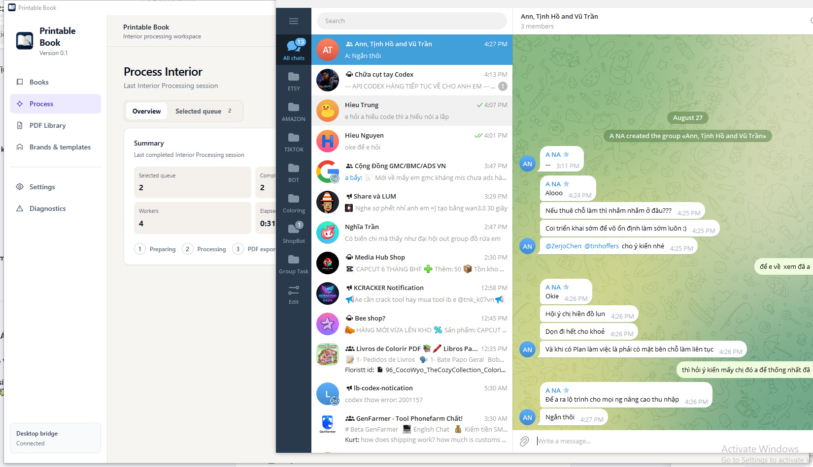

## 12. PDF Library

**PDF Library** liệt kê Book đã có PDF. **Open** mở PDF, **Reveal** mở thư mục output và **Copy** sao chép path. Grid/List, Search và Sort chỉ thay đổi cách xem output hiện có.

## 13. Clear Cache

Trong **Books**, nhấn **Clear Cache** để xóa raster trung gian của Book Completed có output hợp lệ. PDF final vẫn được giữ; workspace state, classification metadata và setting không bị xóa. Reprocess sẽ tạo lại raster cần thiết.

## 14. Settings

**Settings** quản lý concurrency, page geometry, DPI và PDF physical size. Chỉ thay đổi khi hiểu rõ ảnh hưởng lên cache/output.

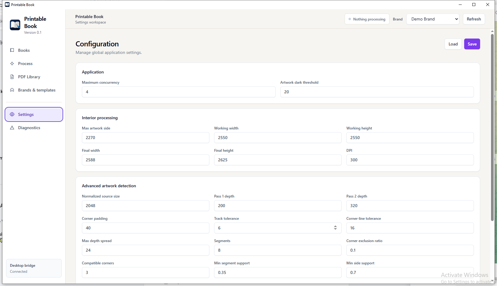

## 15. Advanced artwork detection

Phần advanced chứa normalized source size và BorderLine V3 pass 1/pass 2. Đây là setting kỹ thuật; thay đổi sẽ làm relevant cache stage stale ở lần process tiếp theo.

## 16. Diagnostics

**Diagnostics** là nơi xem snapshot, task history, log và số liệu hiệu năng để hỗ trợ điều tra local.

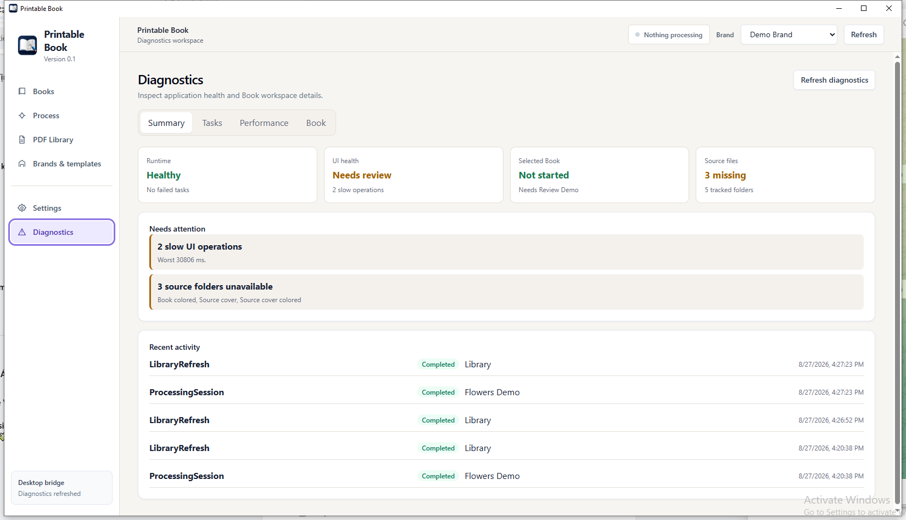
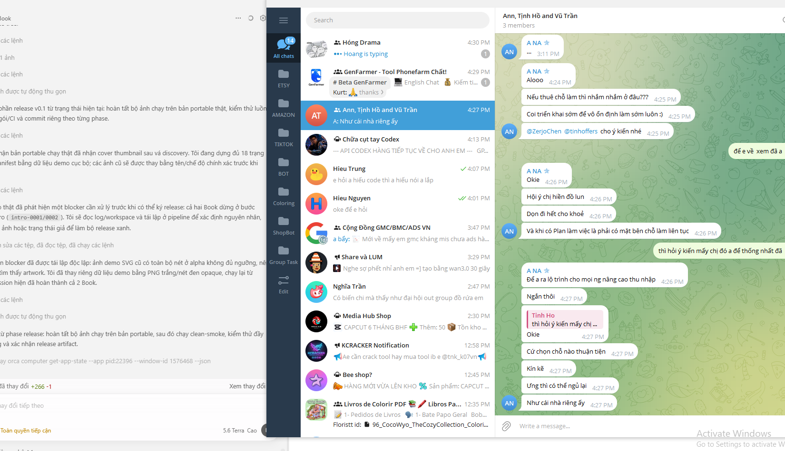
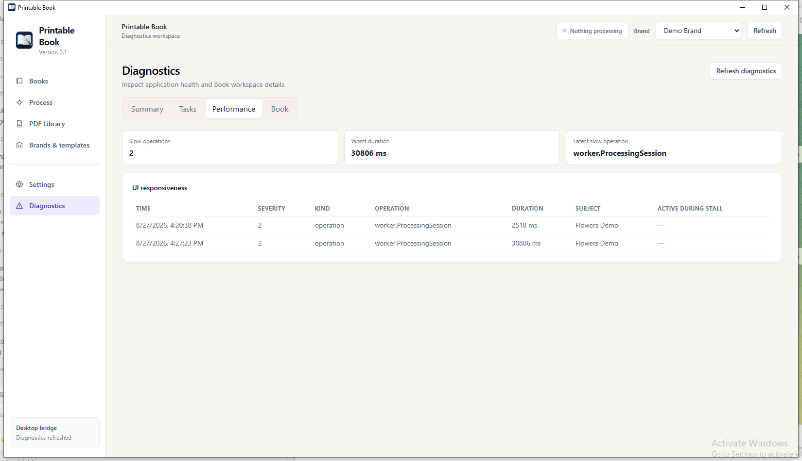

## 17. Các trạng thái Needs review / Invalid

**Needs review** nghĩa là Book cần quyết định của user, ví dụ CUSTOM Intro đã bật nhưng chưa chọn ảnh. **Invalid** nghĩa là dữ liệu source/setting không đạt điều kiện. Mở Book detail, đọc reason, sửa input hoặc selection, **Save changes**, rồi Refresh/Preflight lại.

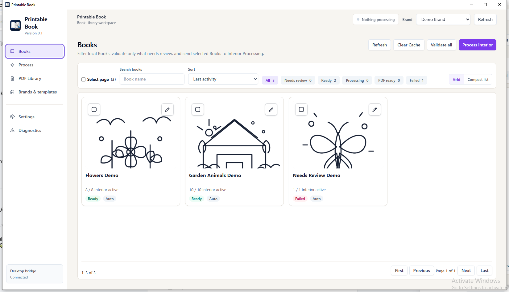

## 18. Troubleshooting

| Triệu chứng | Cách xử lý |
| --- | --- |
| Bridge không kết nối | Đóng app, chạy từ thư mục writable, kiểm tra Frontend còn trong thư mục cạnh executable. |
| Book không xuất hiện | Kiểm tra folder nằm dưới `sources/`, sau đó nhấn **Refresh**. |
| CUSTOM Intro không chạy | Chọn ít nhất một Book Interior image và **Save changes**. |
| Background lỗi | Kiểm tra Brand có `background.png` đúng Final Page size. |
| Không thấy preview sau process | Kiểm tra session Completed và mở lại Book detail/Interior pages. |
| Cần tiết kiệm dung lượng | Dùng **Clear Cache** sau khi xác nhận PDF trong **PDF Library**. |
| Cần log chi tiết | Mở **Diagnostics** và cung cấp log/task state khi báo lỗi. |
